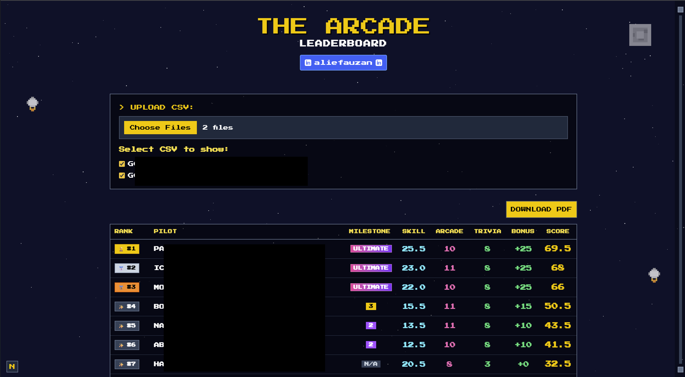
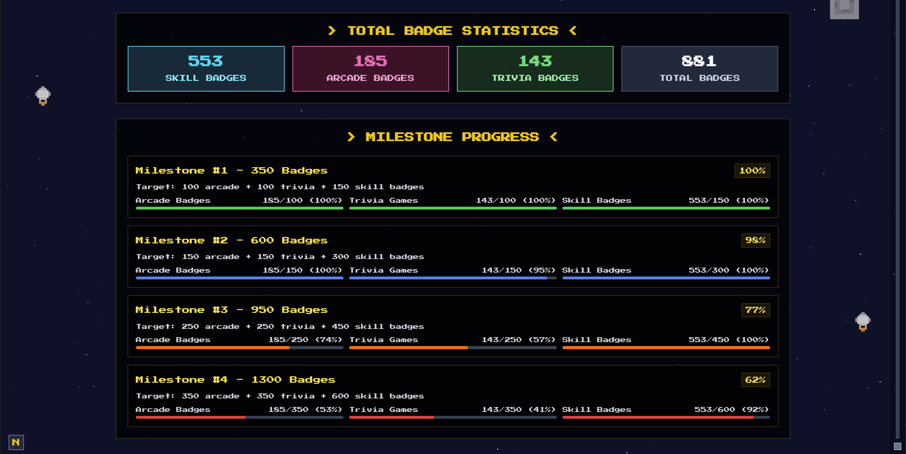

# 🎮 Arcade Team Calculator

**🌐 Live Demo**: [https://arcade-calculator-280204705798.asia-southeast2.run.app/upload](https://arcade-calculator-280204705798.asia-southeast2.run.app/upload)

    

A Next.js web application with **modular architecture** that processes Google Cloud Skills Boost CSV data and generates interactive leaderboards with retro arcade aesthetics.
### Screenshots



## ✨ Key Features

- **🏗️ Modular Architecture**: Clean separation with shared types, constants, and reusable components
- **⚡ High-Performance Processing**: ~15-25 seconds for 115 participants with parallel batch processing
- **🎯 Smart Competition Logic**: Dual scoring system with competition period filtering
- **🎨 Retro Design**: Pixel-perfect 8-bit aesthetic with animated backgrounds and custom fonts
- **📄 Professional PDF Export**: High-quality colored reports with full formatting preservation
- **🔄 Smart Caching**: SHA256-based caching with 45-minute TTL for improved performance
- **🔍 Missing Badge Tracker**: Find which skill badges you haven't earned yet

## 🚀 Quick Start

```bash
# Clone and setup
git clone https://github.com/aliefauzan/ArcadeCalculator.git
cd ArcadeCalculator
npm install

# Start development
npm run dev
# Visit http://localhost:3000
```

## 🏗️ Architecture

### Project Structure
```
src/
├── app/
│   ├── api/
│   │   ├── process-leaderboard/route.ts  # CSV processing endpoint
│   │   ├── personal-profile/route.ts     # Individual profile analysis
│   │   └── scrape/route.ts               # Profile scraping
│   ├── personal/page.tsx                 # Personal analyzer page
│   └── upload/                           # Team leaderboard page
├── components/                           # Reusable UI components
│   ├── index.ts                          # Component exports
│   ├── MissingBadgesModal.tsx            # Missing badges feature
│   ├── ProfileForm.tsx                   # Profile URL input form
│   ├── PixelArt.tsx                      # Decorative pixel art
│   └── Header.tsx                        # Page header
├── constants/                            # App-wide constants
│   └── index.ts                          # Points, milestones, tiers
├── types/                                # Shared TypeScript types
│   └── index.ts                          # All interfaces & types
└── utils/                                # Utility services
    ├── cache-manager.ts                  # SHA256 caching + TTL
    ├── profile-scraper.ts                # Badge scraping
    ├── badge-classifier.ts               # Date filtering + classification
    ├── fetch-utils.ts                    # Smart retry + backoff
    ├── scoring.ts                        # Point calculation + milestones
    └── skill-badges.ts                   # 93 skill badge database
```

### Data Flow
```
CSV Upload → Parsing → Profile Scraping → Badge Classification → Scoring → Leaderboard Display
     ↓           ↓            ↓                   ↓               ↓             ↓
Cache Check → Validation → Batch Processing → Competition Filter → Milestones → PDF Export
```

## 🎯 Scoring System

### Point Values
| Badge Type | Points |
|------------|--------|
| Skill Badges | 0.5 pts |
| Arcade Games | 1.0 pts |
| Trivia Games | 1.0 pts |
| Extra Badges | 2.0 pts |
| Premium Extra | 3.0 pts |

### Milestones
| Milestone | Arcade | Trivia | Skill | Bonus |
|-----------|--------|--------|-------|-------|
| 🏅 CADET | 4 | 4 | 10 | +7 pts |
| 🥉 SPACE PILOT | 6 | 6 | 20 | +14 pts |
| 🥈 GALAXY COMMANDER | 8 | 7 | 30 | +19 pts |
| 🥇 ULTIMATE MASTER | 10 | 8 | 44 | +28 pts |

### Arcade Tiers
| Tier | Points Range |
|------|-------------|
| ⭐ Novice | 0-24 |
| ⭐⭐ Trooper | 25-44 |
| ⭐⭐⭐ Ranger | 45-64 |
| ⭐⭐⭐⭐ Champion | 65-94 |
| ⭐⭐⭐⭐⭐ Legend | 95+ |

## 📡 API Endpoints

### Process CSV Data
```http
POST /api/process-leaderboard
Content-Type: text/csv or multipart/form-data
```

### Individual Profile Analysis
```http
POST /api/personal-profile
Content-Type: application/json
Body: {"url": "profile-url"}
```

### Profile Scraping
```http
POST /api/scrape
Content-Type: application/json
Body: {"url": "profile-url"}
```

## 🐳 Deployment

### Docker
```bash
docker build -t arcade-calculator .
docker run -p 3000:3000 arcade-calculator
```

### Google Cloud Run
```bash
gcloud builds submit --tag gcr.io/PROJECT_ID/arcade-calculator
gcloud run deploy --image gcr.io/PROJECT_ID/arcade-calculator --allow-unauthenticated
```

## 🛠️ Development

```bash
# Development
npm run dev

# Production build
npm run build
npm run start

# Linting
npm run lint
```

## 📈 Performance

| Metric | Performance |
|--------|-------------|
| **Processing Time** | ~15-25 seconds (115 participants) |
| **Batch Size** | 20 participants (optimized) |
| **Network Efficiency** | 80% fewer requests with smart image logic |
| **Caching** | 45-minute TTL with SHA256 hashing |

## 🎨 Tech Stack

- **Frontend**: Next.js 15.4.10, React 19, TypeScript, Tailwind CSS 4
- **Backend**: Next.js API Routes, Papa Parse, Cheerio
- **PDF**: @react-pdf/renderer
- **Deploy**: Docker, Vercel, Google Cloud

## 📝 License

MIT License - see [LICENSE](LICENSE) for details.

## 👨‍💻 Author

**Alief Fauzan**
- 🌐 [LinkedIn](https://www.linkedin.com/in/alief-fauzan1/)
- 🐙 [GitHub](https://github.com/aliefauzan)

---

*A powerful, performance-optimized tool for managing Google Cloud Skills Boost competitions with retro arcade style!* 🎮