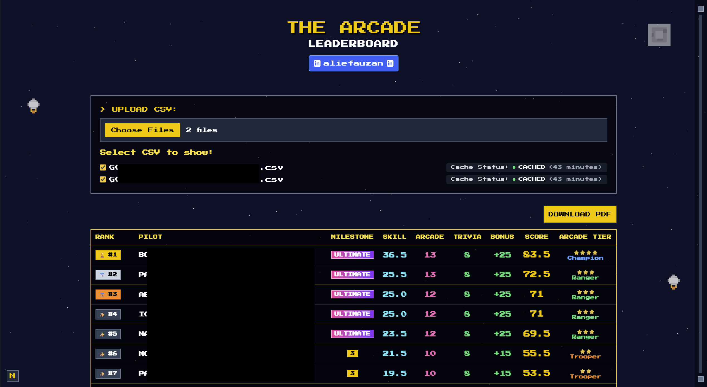

# 🎮 Arcade Team Calculator
#(https://arcade-calculator-280204705798.asia-southeast2.run.app/upload)
### Screenshots




A powerful Next.js web application designed to process Google Cloud Skills Boost CSV data and generate interactive leaderboards for arcade team. This tool automatically scrapes participant profiles, calculates points based on achievements, and provides beautiful visualizations with PDF export capabilities.


## 📋 Table of Contents

- [Overview](#-overview)
- [Features](#-features)
- [Demo](#-demo)
- [Architecture](#️-architecture)
- [Quick Start](#-quick-start)
- [Local Development](#-local-development)
- [Docker Deployment](#-docker-deployment)
- [Cloud Deployment](#️-cloud-deployment)
- [API Documentation](#-api-documentation)
- [Configuration](#️-configuration)
- [Contributing](#-contributing)
- [License](#-license)

## 🌟 Overview

The Arcade Team Calculator is an intelligent leaderboard management system that transforms Google Cloud Skills Boost participant data into engaging, competitive visualizations. Unlike basic spreadsheet tools, this application provides real-time web scraping, automated scoring calculations, and professional presentation with retro arcade aesthetics.

### What Makes Arcade Calculator Special?

- 🚀 **Automated Data Processing**: Intelligent CSV parsing with multi-file support and data validation
- 🌐 **Real-time Profile Scraping**: Dynamic extraction of achievement data from Google Cloud Skills Boost profiles
- 🏆 **Smart Scoring System**: Sophisticated point calculation with milestone bonuses and achievement recognition
- 🎨 **Retro Arcade Design**: Pixel-perfect 8-bit aesthetic with animated backgrounds and custom fonts
- 📄 **Professional PDF Export**: High-quality, colored PDF reports with custom branding
- 📱 **Responsive Experience**: Seamless operation across desktop and mobile devices
- ☁️ **Cloud-Ready**: Fully containerized with Docker and deployable to multiple cloud platformsde Team Calculator

A powerful Next.js web application designed to process Google Cloud Skills Boost CSV data and generate interactive leaderboards for arcade team. This tool automatically scrapes participant profiles, calculates points based on achievements, and provides beautiful visualizations with PDF export capabilities.


## ✨ Features

### Core Functionality
- **Multi-File CSV Processing**: Upload and process up to 2 CSV files simultaneously with intelligent data merging
- **Real-time Profile Scraping**: Automated extraction of achievement data from Google Cloud Skills Boost profiles
- **Dynamic Leaderboard Generation**: Real-time calculation and ranking with live updates
- **Smart Caching System**: Efficient caching to minimize redundant API calls and improve performance

### Cache Status Indicator

Each uploaded CSV file now shows a per-file cache status indicator in the upload UI so users can immediately see whether the data is being processed, freshly generated, or served from cache:

- PROCESSING... (yellow, pulsing) — shown immediately after upload while the server processes the file.
- FRESH (blue) — data was freshly processed (not from cache).
- CACHED (green) — data was returned from the cache for faster results.

The indicator also shows the cache expiration time (for example: `(42 minutes)`).

API responses include the following fields which the frontend uses to populate the indicator:

- `cacheStatus`: `"HIT"` or `"MISS"` (or transitional `"PROCESSING"` state used on the frontend)
- `cacheExpiresIn`: human-readable time until cache expiration (e.g., `"45 minutes"`)

This provides clear, per-file feedback so users understand caching behavior at a glance.

### Advanced Scoring Features
- **Intelligent Point Calculation**: Automated scoring based on multiple achievement types:
  - Skill badges: 0.5 points each
  - Arcade games: 1 point each
  - Trivia games: 1 point each
  - Milestone bonuses: up to 25 points
- **Milestone Recognition System**: Four distinct achievement levels:
  - 🥇 **ULTIMATE**: Highest tier with gradient pink-violet badge
  - 🥈 **Level 3**: Galaxy Commander with yellow badge
  - 🥉 **Level 2**: Space Pilot with purple badge
  - 🏅 **Level 1**: Cadet with green badge
- **Flexible Scoring Logic**: Easily configurable point values and milestone criteria

### Visual & UX Features
- **Retro Arcade Aesthetic**: Pixel-perfect 8-bit inspired design with custom animations
- **🚀 Rocket-Themed Progress Bar**: Interactive animated progress indicator with flying rocket that follows batch processing in real-time
- **Dynamic Backgrounds**: Animated starfield with floating pixel spaceships
- **Custom Typography**: Press Start 2P pixel font for authentic retro gaming feel
- **Color-coded Data**: Intuitive color system for different data types and achievements
- **Interactive Elements**: Hover effects, loading animations, and smooth transitions
- **Responsive Design**: Optimized for all screen sizes from mobile to desktop

### Progress & Loading Experience
- **🎯 Batch-Accurate Progress**: Progress bar synchronized with actual API batch processing (e.g., batch 2/10 = 20% progress)
- **🚀 Animated Rocket Indicator**: Custom SVG rocket that travels along the progress bar, showing exact completion percentage
- **⚡ Real-time Updates**: Smooth progress animation that updates every 500ms during data processing
- **🎨 Pixel Art Components**: Custom PixelRocket and ThemeRocket SVG components with retro gaming aesthetics
- **📊 Smart Progress Calculation**: Intelligent estimation based on participant count and batch size (10 participants per batch)
- **✨ Smooth Transitions**: 500ms CSS transitions for seamless visual experience

### Export & Reporting
- **Professional PDF Generation**: High-quality PDF reports with maintained color schemes
- **Custom Branding**: Includes author information and social media links
- **Print-ready Format**: Landscape orientation optimized for professional presentation
- **Colored PDF Output**: Full color support in exported documents

### Technical Features
- **Full TypeScript Coverage**: Type-safe development with comprehensive error prevention
- **API-First Architecture**: RESTful design for easy integration and extensibility
- **Docker Containerization**: Complete containerization for easy deployment and scaling
- **Cloud Platform Ready**: Optimized for deployment on Google Cloud, Vercel, Netlify, and more
- **Performance Optimized**: Efficient caching, code splitting, and optimized assets

## 🎯 Demo

*The Arcade Calculator in action - showing the retro-themed leaderboard with colorful milestone badges, real-time scoring, and professional presentation*

### Main Interface Features

- **Intuitive Upload Interface**: Drag-and-drop CSV file upload with progress indicators
- **Real-time Processing**: Live progress updates during data scraping and calculation
- **Interactive Leaderboard**: Sortable, filterable results with detailed participant information
- **Visual Feedback**: Loading animations and status indicators for all operations

### Key Demo Highlights

- **Smart Data Processing**: Automatic CSV parsing with error detection and validation
- **🚀 Rocket Progress Animation**: Real-time progress bar with animated rocket that follows batch processing completion
- **Live Leaderboard Updates**: Real-time ranking updates as data is processed
- **Professional Presentation**: Clean, organized display of complex achievement data
- **Export Functionality**: One-click PDF generation with full color preservation

## 🚀 Quick Start

### Prerequisites

- **Node.js** 18+ (LTS recommended)
- **npm**, **yarn**, **pnpm**, or **bun** package manager
- **Docker** (optional, for containerized deployment)
- **Git** for version control

### 1-Minute Setup

```bash
# Clone the repository
git clone https://github.com/aliefauzan/ArcadeCalculator.git
cd ArcadeCalculator

# Install dependencies
npm install

# Start development server
npm run dev

# Visit http://localhost:3000 and start calculating scores! 🎉
```

## 💻 Local Development

### Standard Setup

1. **Clone and Navigate**
   ```bash
   git clone https://github.com/aliefauzan/ArcadeCalculator.git
   cd ArcadeCalculator
   ```

2. **Install Dependencies**
   ```bash
   npm install
   # or
   yarn install
   # or
   pnpm install
   # or
   bun install
   ```

3. **Start Development Server**
   ```bash
   npm run dev
   # or
   yarn dev
   # or
   pnpm dev
   # or
   bun dev
   ```

4. **Access Application**
   - Open [http://localhost:3000](http://localhost:3000) in your browser
   - The app will automatically redirect to the upload interface

### Development Workflow

1. **Frontend Development**
   - Main application: `src/app/upload/page.tsx`
   - Components: `src/components/`
   - Styles: `src/app/globals.css` + Tailwind classes
   - PDF components: `src/app/upload/LeaderboardPDF.tsx`

2. **Backend Development**
   - API routes: `src/app/api/`
   - Main processor: `src/app/api/process-leaderboard/route.ts`
   - Scraping service: `src/app/api/scrape/route.ts`

3. **Testing**
   ```bash
   # Lint code
   npm run lint
   
   # Build for production (test)
   npm run build
   
   # Test CSV upload with sample data
   # Use the web interface at http://localhost:3000
   ```

### Building for Production

```bash
# Create optimized production build
npm run build

# Start production server
npm run start

# Access at http://localhost:3000
```

## 🐳 Docker Deployment

### Quick Docker Setup

1. **Build Docker Image**
   ```bash
   docker build -t arcade-calculator .
   ```

2. **Run Container**
   ```bash
   docker run -p 3000:3000 arcade-calculator
   ```

3. **Access Application**
   - Open [http://localhost:3000](http://localhost:3000)

### Docker Compose Deployment

Create `docker-compose.yml`:

```yaml
version: '3.8'

services:
  arcade-calculator:
    build: .
    ports:
      - "3000:3000"
    environment:
      - NODE_ENV=production
    restart: unless-stopped
    volumes:
      - ./logs:/app/logs  # Optional: for log persistence

  # Optional: Add reverse proxy
  nginx:
    image: nginx:alpine
    ports:
      - "80:80"
    volumes:
      - ./nginx.conf:/etc/nginx/nginx.conf
    depends_on:
      - arcade-calculator
    restart: unless-stopped
```

Run with Docker Compose:

```bash
# Start services
docker-compose up -d

# View logs
docker-compose logs -f

# Stop services
docker-compose down
```

### Production Docker Configuration

For production deployments, consider this optimized `Dockerfile`:

```dockerfile
# Multi-stage build for optimized production image
FROM node:18-alpine AS deps
WORKDIR /app
COPY package*.json ./
RUN npm ci --only=production

FROM node:18-alpine AS builder
WORKDIR /app
COPY package*.json ./
RUN npm ci
COPY . .
RUN npm run build

FROM node:18-alpine AS runner
WORKDIR /app
ENV NODE_ENV production

RUN addgroup --system --gid 1001 nodejs
RUN adduser --system --uid 1001 nextjs

COPY --from=builder /app/public ./public
COPY --from=builder --chown=nextjs:nodejs /app/.next/standalone ./
COPY --from=builder --chown=nextjs:nodejs /app/.next/static ./.next/static

USER nextjs
EXPOSE 3000
ENV PORT 3000

CMD ["node", "server.js"]
```

### Docker Best Practices

1. **Environment Variables**
   ```bash
   # Create .env file for Docker
   echo "NODE_ENV=production" > .env.docker
   
   # Run with environment file
   docker run --env-file .env.docker -p 3000:3000 arcade-calculator
   ```

2. **Volume Mounting**
   ```bash
   # Mount logs directory
   docker run -v ./logs:/app/logs -p 3000:3000 arcade-calculator
   ```

3. **Health Checks**
   ```dockerfile
   # Add to Dockerfile
   HEALTHCHECK --interval=30s --timeout=3s --start-period=5s --retries=3 \
     CMD curl -f http://localhost:3000/ || exit 1
   ```

## 📋 How to Use

### Step 1: Prepare Your CSV Data
- Export participant data from Google Cloud Skills Boost
- Ensure CSV contains the required columns:
  - `Nama Peserta` (Participant Name)
  - `Email Peserta` (Participant Email)
  - `URL Profil Google Cloud Skills Boost` (Profile URL)
  - Other relevant fields for tracking achievements

### Step 2: Upload CSV Files
1. Click on the file upload area
2. Select up to 2 CSV files
3. Choose which files to include in the calculation
4. Wait for processing to complete

### Step 3: View Results
- Automatic leaderboard generation with real-time scoring
- Color-coded milestones and achievement indicators
- Sortable rankings with detailed breakdowns

### Step 4: Export PDF (Optional)
- Click "DOWNLOAD PDF" to generate a printable report
- PDF includes all colors and formatting from the web interface

## 🏗️ Architecture

```
┌─────────────────┐    ┌─────────────────┐    ┌─────────────────┐
│    Frontend     │    │   Backend API   │    │  External APIs  │
│   (Next.js)     │◄──►│   (Next.js)     │◄──►│                 │
│                 │    │                 │    │ • Google Cloud  │
│ • React 19      │    │ • CSV Parser    │    │   Skills Boost  │
│ • TypeScript    │    │ • Web Scraper   │    │ • Profile URLs  │
│ • Tailwind CSS  │    │ • Score Engine  │    │ • Achievement   │
│ • PDF Renderer  │    │ • Cache System  │    │   Data          │
│ • Pixel UI      │    │ • API Routes    │    │                 │
└─────────────────┘    └─────────────────┘    └─────────────────┘
        │                       │
        │                       │
        ▼                       ▼
┌─────────────────┐    ┌─────────────────┐
│   Docker        │    │   Docker        │
│   Container     │    │   Container     │
│   (Production)  │    │   (Optional)    │
└─────────────────┘    └─────────────────┘
        │                       │
        │                       │
        ▼                       ▼
┌─────────────────────────────────────────┐
│         Cloud Deployment Options       │
│                                         │
│ • Vercel (Recommended)                  │
│ • Google Cloud Platform                 │
│ • Netlify                              │
│ • Railway                              │
│ • Docker Compose                       │
└─────────────────────────────────────────┘
```

### Project Structure

```
arcadeteamcalculator/
├── 📁 src/
│   ├── 📁 app/                     # Next.js App Router
│   │   ├── 📁 api/                 # Backend API routes
│   │   │   ├── 📁 process-leaderboard/
│   │   │   │   └── 📄 route.ts     # Main processing endpoint
│   │   │   └── 📁 scrape/
│   │   │       └── 📄 route.ts     # Profile scraping endpoint
│   │   ├── 📁 upload/              # Main application pages
│   │   │   ├── 📄 page.tsx         # Upload interface
│   │   │   └── 📄 LeaderboardPDF.tsx # PDF generation
│   │   ├── 📄 layout.tsx           # Root layout
│   │   ├── 📄 page.tsx             # Home redirect
│   │   └── 📄 globals.css          # Global styles
│   └── 📁 components/              # Reusable components
│       └── 📄 PDFDownloadButton.tsx # PDF export component
├── 📁 public/                      # Static assets
│   └── 📁 fonts/                   # Custom pixel fonts
│       └── 📁 Press_Start_2P/
├── 🐳 Dockerfile                   # Container configuration
├── ☁️ cloudbuild.yaml             # Google Cloud Build config
├── 📄 package.json                 # Dependencies and scripts
├── 📄 next.config.ts               # Next.js configuration
├── 📄 tailwind.config.ts           # Tailwind CSS config
├── 📄 tsconfig.json                # TypeScript configuration
└── 📄 README.md                    # This file
```

### Data Flow Architecture

```
CSV Upload → Data Parsing → Profile Scraping → Score Calculation → Leaderboard Display
     ↓              ↓              ↓                ↓                    ↓
File Validation → Error Check → Cache Check → Point Assignment → PDF Export
     ↓              ↓              ↓                ↓                    ↓
Multi-file → Papa Parse → Cheerio Scraper → Milestone Logic → React PDF
Support         Library      Web Scraping      Bonus Points      Generation
```

### Technology Stack

#### Frontend Layer
- **Framework**: Next.js 15.4.4 with App Router for modern React development
- **UI Library**: React 19 with TypeScript for type-safe component development
- **Styling**: Tailwind CSS 4 with custom pixel art components and animations
- **PDF Generation**: @react-pdf/renderer for high-quality document export
- **Typography**: Custom Press Start 2P pixel font for retro arcade aesthetics

#### Backend Layer
- **Runtime**: Next.js API Routes for serverless function architecture
- **Data Processing**: Papa Parse for robust CSV parsing and validation
- **Web Scraping**: Cheerio for server-side HTML parsing and data extraction
- **Caching**: In-memory caching system for performance optimization
- **Error Handling**: Comprehensive error boundaries and validation

#### Infrastructure Layer
- **Containerization**: Docker for consistent deployment across environments
- **Build System**: Next.js optimized build with automatic code splitting
- **Static Assets**: Optimized image and font serving with Next.js built-ins
- **API Design**: RESTful architecture with JSON responses

## ☁️ Cloud Deployment

### Vercel (Recommended)

[](https://vercel.com/new/clone?repository-url=https://github.com/aliefauzan/ArcadeCalculator)

#### Quick Vercel Deployment

1. **One-Click Deploy**
   - Click the "Deploy with Vercel" button above
   - Connect your GitHub account
   - Fork the repository
   - Deploy automatically

2. **Manual Vercel Deployment**
   ```bash
   # Install Vercel CLI
   npm install -g vercel
   
   # Deploy to Vercel
   vercel --prod
   ```

3. **Environment Configuration**
   - No additional environment variables required
   - Automatic optimizations applied
   - Global CDN distribution included

### Google Cloud Platform

#### Prerequisites

1. **Google Cloud Setup**
   ```bash
   # Install Google Cloud CLI
   # Visit: https://cloud.google.com/sdk/docs/install
   
   # Authenticate
   gcloud auth login
   gcloud config set project YOUR_PROJECT_ID
   ```

2. **Enable Required APIs**
   ```bash
   gcloud services enable run.googleapis.com
   gcloud services enable cloudbuild.googleapis.com
   gcloud services enable containerregistry.googleapis.com
   ```

#### Cloud Run Deployment

1. **Build and Deploy**
   ```bash
   # Build and submit to Cloud Build
   gcloud builds submit --tag gcr.io/YOUR_PROJECT_ID/arcade-calculator
   
   # Deploy to Cloud Run
   gcloud run deploy arcade-calculator \
     --image gcr.io/YOUR_PROJECT_ID/arcade-calculator \
     --platform managed \
     --region us-central1 \
     --allow-unauthenticated
   ```

2. **Using Cloud Build Configuration**
   
   Create `cloudbuild.yaml`:
   ```yaml
   steps:
   # Build the container image
   - name: 'gcr.io/cloud-builders/docker'
     args: ['build', '-t', 'gcr.io/$PROJECT_ID/arcade-calculator', '.']
   
   # Push the container image to Container Registry
   - name: 'gcr.io/cloud-builders/docker'
     args: ['push', 'gcr.io/$PROJECT_ID/arcade-calculator']
   
   # Deploy container image to Cloud Run
   - name: 'gcr.io/google.com/cloudsdktool/cloud-sdk'
     entrypoint: gcloud
     args:
     - 'run'
     - 'deploy'
     - 'arcade-calculator'
     - '--image'
     - 'gcr.io/$PROJECT_ID/arcade-calculator'
     - '--region'
     - 'us-central1'
     - '--platform'
     - 'managed'
     - '--allow-unauthenticated'
   
   images:
   - 'gcr.io/$PROJECT_ID/arcade-calculator'
   ```

   Deploy with:
   ```bash
   gcloud builds submit --config cloudbuild.yaml .
   ```

### Alternative Deployment Options

#### Netlify

1. **Netlify CLI Deployment**
   ```bash
   # Install Netlify CLI
   npm install -g netlify-cli
   
   # Build the project
   npm run build
   
   # Deploy to Netlify
   netlify deploy --prod --dir=out
   ```

2. **Netlify Git Integration**
   - Connect repository to Netlify
   - Set build command: `npm run build`
   - Set publish directory: `out`
   - Enable automatic deployments

#### Railway

1. **Railway CLI Deployment**
   ```bash
   # Install Railway CLI
   npm install -g @railway/cli
   
   # Login and deploy
   railway login
   railway link
   railway up
   ```

2. **Railway Git Integration**
   - Connect GitHub repository
   - Automatic deployments on push
   - Built-in domain and SSL

#### AWS (Amazon Web Services)

1. **AWS Amplify**
   ```bash
   # Install Amplify CLI
   npm install -g @aws-amplify/cli
   
   # Initialize and deploy
   amplify init
   amplify add hosting
   amplify publish
   ```

2. **AWS ECS with Fargate**
   ```bash
   # Build and push to ECR
   aws ecr get-login-password --region us-east-1 | docker login --username AWS --password-stdin YOUR_ECR_URI
   docker build -t arcade-calculator .
   docker tag arcade-calculator:latest YOUR_ECR_URI:latest
   docker push YOUR_ECR_URI:latest
   ```

#### Self-Hosted (VPS)

1. **Docker Deployment**
   ```bash
   # On your server
   git clone https://github.com/aliefauzan/ArcadeCalculator.git
   cd ArcadeCalculator
   
   # Build and run
   docker build -t arcade-calculator .
   docker run -d -p 3000:3000 --name arcade-app arcade-calculator
   ```

2. **PM2 Process Manager**
   ```bash
   # Install PM2
   npm install -g pm2
   
   # Build the project
   npm run build
   
   # Start with PM2
   pm2 start npm --name "arcade-calculator" -- start
   pm2 startup
   pm2 save
   ```

3. **Nginx Reverse Proxy**
   ```nginx
   server {
       listen 80;
       server_name your-domain.com;
       
       location / {
           proxy_pass http://localhost:3000;
           proxy_http_version 1.1;
           proxy_set_header Upgrade $http_upgrade;
           proxy_set_header Connection 'upgrade';
           proxy_set_header Host $host;
           proxy_set_header X-Real-IP $remote_addr;
           proxy_set_header X-Forwarded-For $proxy_add_x_forwarded_for;
           proxy_set_header X-Forwarded-Proto $scheme;
           proxy_cache_bypass $http_upgrade;
       }
   }
   ```

### Deployment Checklist

- [ ] Choose deployment platform
- [ ] Configure custom domain (optional)
- [ ] Set up SSL certificate
- [ ] Configure monitoring/logging
- [ ] Set up automated backups
- [ ] Test application functionality
- [ ] Configure CDN (if applicable)
- [ ] Set up continuous deployment

## � API Documentation

### Base URL

- **Local Development**: `http://localhost:3000`
- **Production**: `https://your-domain.com`

### Endpoints

#### Process Leaderboard Data

**Endpoint**: `POST /api/process-leaderboard`

**Description**: Processes uploaded CSV data, scrapes participant profiles, and calculates leaderboard rankings.

**Content-Type**: `text/csv` or `multipart/form-data`

**Request Body**:
```
# For CSV text
Raw CSV content as text

# For form data
csvFile: File upload(s)
```

**Response Format**:
```json
{
  "cacheStatus": "string",
  "leaderboard": [
    {
      "nama": "Participant Name",
      "skillPoints": 23.0,
      "arcadePoints": 10,
      "triviaPoints": 8,
      "bonusPoints": 25,
      "totalPoints": 66.0,
      "milestone": "ULTIMATE",
      "skillCount": 46,
      "arcadeCount": 10,
      "triviaCount": 8
    }
  ]
}
```

#### Scrape Profile Data

**Endpoint**: `POST /api/scrape`

**Description**: Scrapes individual Google Cloud Skills Boost profile for achievement data.

**Content-Type**: `application/json`

**Request Body**:
```json
{
  "url": "https://www.cloudskillsboost.google/public_profiles/profile-id"
}
```

**Response Format**:
```json
{
  "skillBadges": 46,
  "arcadeGames": 10,
  "triviaGames": 8,
  "milestone": "ULTIMATE MASTER",
  "details": {
    "skillBadgeNames": ["Badge 1", "Badge 2"],
    "arcadeGameNames": ["Game 1", "Game 2"],
    "triviaGameNames": ["Trivia 1", "Trivia 2"]
  }
}
```

### Example Requests

#### Process CSV Data

```bash
# Upload CSV file
curl -X POST http://localhost:3000/api/process-leaderboard \
  -H "Content-Type: text/csv" \
  -d @participants.csv
```

```javascript
// JavaScript fetch example
const csvData = "Nama Peserta,Email Peserta,URL Profil Google Cloud Skills Boost\nJohn Doe,john@example.com,https://profile-url";

fetch('/api/process-leaderboard', {
  method: 'POST',
  headers: {
    'Content-Type': 'text/csv'
  },
  body: csvData
})
.then(response => response.json())
.then(data => console.log(data));
```

#### Scrape Individual Profile

```bash
# Scrape single profile
curl -X POST http://localhost:3000/api/scrape \
  -H "Content-Type: application/json" \
  -d '{"url": "https://www.cloudskillsboost.google/public_profiles/example"}'
```

```javascript
// JavaScript fetch example
fetch('/api/scrape', {
  method: 'POST',
  headers: {
    'Content-Type': 'application/json'
  },
  body: JSON.stringify({
    url: 'https://www.cloudskillsboost.google/public_profiles/example'
  })
})
.then(response => response.json())
.then(data => console.log(data));
```

### Error Handling

**Error Response Format**:
```json
{
  "error": "Error message description",
  "details": "Additional error context",
  "status": 400
}
```

**Common Error Codes**:

- `400 Bad Request`: Invalid CSV format or missing required fields
- `404 Not Found`: Profile URL not accessible or invalid
- `429 Too Many Requests`: Rate limiting applied
- `500 Internal Server Error`: Server processing error
- `503 Service Unavailable`: External service (Google Cloud Skills Boost) unavailable

### Rate Limiting

The API implements intelligent rate limiting to prevent overloading external services:

- **Batch Processing**: Processes participants in batches of 10
- **Request Delays**: 1.2-second delays between requests
- **Retry Logic**: Automatic retry with exponential backoff
- **Caching**: Results cached to minimize redundant requests

### CSV Format Requirements

**Required Columns**:
- `Nama Peserta`: Participant name
- `Email Peserta`: Participant email
- `URL Profil Google Cloud Skills Boost`: Profile URL

**Optional Columns**:
- `Nomor HP Peserta`: Phone number
- `Status URL Profil`: Profile status
- `Status Redeem Kode Akses`: Redemption status
- `Milestone yang Diselesaikan`: Completed milestone
- Additional achievement tracking columns

**Example CSV Structure**:
```csv
Nama Peserta,Email Peserta,URL Profil Google Cloud Skills Boost
John Doe,john@example.com,https://www.cloudskillsboost.google/public_profiles/12345
Jane Smith,jane@example.com,https://www.cloudskillsboost.google/public_profiles/67890
```

## ⚙️ Configuration

### Environment Variables
Create a `.env.local` file in the root directory:

```env
# Add any environment variables here
# NEXT_PUBLIC_APP_URL=https://your-domain.com
```

### Customization

#### Styling
- Modify `src/app/globals.css` for global styles
- Update `tailwind.config.ts` for custom theme configuration
- Edit component styles in individual `.tsx` files

#### Scoring Logic
- Adjust point calculations in `src/app/api/process-leaderboard/route.ts`
- Modify milestone thresholds and bonuses as needed

#### PDF Styling
- Customize PDF appearance in `src/app/upload/LeaderboardPDF.tsx`
- Update colors, fonts, and layout to match your branding

## 🤝 Contributing

We welcome contributions! Please follow these guidelines to ensure a smooth collaboration process.

### Getting Started

1. **Fork** the repository
2. **Create** a feature branch
   ```bash
   git checkout -b feature/amazing-feature
   ```
3. **Make** your changes
4. **Test** thoroughly
5. **Submit** a pull request

### Development Guidelines

#### Code Style

- **Backend**: Follow Node.js and Next.js best practices
- **Frontend**: Use TypeScript and React hooks
- **Styling**: Tailwind CSS utility classes with consistent naming
- **Formatting**: ESLint configuration included

#### Commit Convention

```
feat: add new scoring algorithm
fix: resolve PDF export timeout
docs: update deployment guide
style: improve mobile responsiveness
refactor: optimize scraping service
test: add unit tests for scoring logic
```

#### Testing

```bash
# Lint code
npm run lint

# Build test
npm run build

# Test the application manually
npm run dev
# Visit http://localhost:3000 and test CSV upload
```

### Issue Reporting

When reporting issues, please include:

- **Environment details** (OS, Node.js version, browser)
- **Steps to reproduce** the issue
- **Expected vs actual behavior**
- **Screenshots** (for UI issues)
- **Error logs** (if applicable)
- **CSV sample** (if data-related, remove sensitive information)

### Feature Requests

For new features, please:

1. **Check existing issues** first
2. **Describe the use case** clearly
3. **Provide implementation ideas** if possible
4. **Consider backward compatibility**
5. **Include mockups** for UI changes

### Pull Request Process

1. **Update documentation** if needed
2. **Add tests** for new functionality
3. **Ensure all checks pass**
4. **Request review** from maintainers
5. **Address feedback** promptly

## 📝 License

This project is licensed under the MIT License - see the [LICENSE](LICENSE) file for details.

```
MIT License

Copyright (c) 2024 Alief Fauzan

Permission is hereby granted, free of charge, to any person obtaining a copy
of this software and associated documentation files (the "Software"), to deal
in the Software without restriction, including without limitation the rights
to use, copy, modify, merge, publish, distribute, sublicense, and/or sell
copies of the Software, and to permit persons to whom the Software is
furnished to do so, subject to the following conditions:

The above copyright notice and this permission notice shall be included in all
copies or substantial portions of the Software.

THE SOFTWARE IS PROVIDED "AS IS", WITHOUT WARRANTY OF ANY KIND, EXPRESS OR
IMPLIED, INCLUDING BUT NOT LIMITED TO THE WARRANTIES OF MERCHANTABILITY,
FITNESS FOR A PARTICULAR PURPOSE AND NONINFRINGEMENT. IN NO EVENT SHALL THE
AUTHORS OR COPYRIGHT HOLDERS BE LIABLE FOR ANY CLAIM, DAMAGES OR OTHER
LIABILITY, WHETHER IN AN ACTION OF CONTRACT, TORT OR OTHERWISE, ARISING FROM,
OUT OF OR IN CONNECTION WITH THE SOFTWARE OR THE USE OR OTHER DEALINGS IN THE
SOFTWARE.
```

## 🙏 Acknowledgments

- **Google Cloud Skills Boost** for providing the platform that inspired this tool
- **Papa Parse** for excellent CSV parsing capabilities
- **React PDF** for high-quality document generation
- **Cheerio** for robust web scraping functionality
- **Next.js & React** for the amazing development framework
- **Tailwind CSS** for the utility-first styling approach
- **Press Start 2P** font for authentic retro gaming aesthetics
- **Open Source Community** for the incredible tools and libraries

## 🔗 Links

- **Repository**: [GitHub](https://github.com/aliefauzan/ArcadeCalculator)
- **Issues**: [GitHub Issues](https://github.com/aliefauzan/ArcadeCalculator/issues)
- **Discussions**: [GitHub Discussions](https://github.com/aliefauzan/ArcadeCalculator/discussions)
- **Author**: [@aliefauzan](https://github.com/aliefauzan)

## 👨‍💻 Author

**Alief Fauzan**
- 🌐 **LinkedIn**: [@alief-fauzan1](https://www.linkedin.com/in/alief-fauzan1/)
- 🐙 **GitHub**: [@aliefauzan](https://github.com/aliefauzan)
